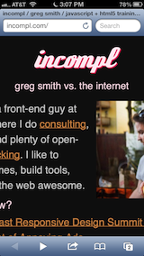
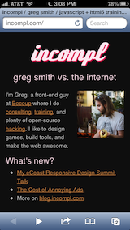

# ios-reorient

## A fix for orientation change of unzoomable webapps on iOS. 

There are plenty of workarounds for iOS reorientation quirks, but none of them worked for my case: a game with an unzoomable fixed layout that was subject to bizarre buggy behavior on orientation change. This code is my solution to that problem.

## The meta viewport tag

Here is the meta viewport tag that this JavaScript was designed to work with:

    <meta name="viewport" content="width=device-width, height=device-height, initial-scale=1.0, maximum-scale=1, minimum-scale=1, user-scalable=no">

## What does it look like?

Here is an example of the iOS quirk I'm addressing. I temporarily added the above meta viewport tag to my personal site to illustrate the problem. Screenshots taken on an iPhone 5.

## Without the fix

### Changing portrait to landscape

The right side of the screen contains glitchy graphical artifacts repeating the main content. Sometimes the right side of the screen is just black. Either way, this is not good.

### Changing portrait to landscape

The content is truncated and the user cannot zoom it.

## With the fix

### Changing portrait to landscape

### Changing portrait to landscape

## License

Public domain.

## About me

http://incompl.com
